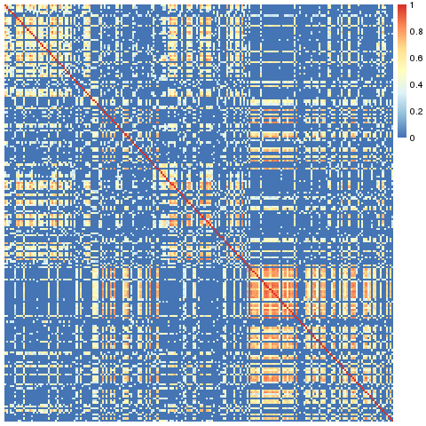
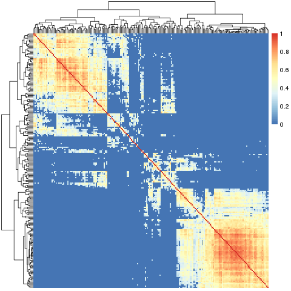
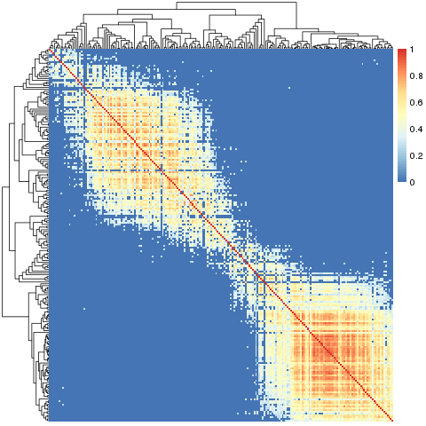
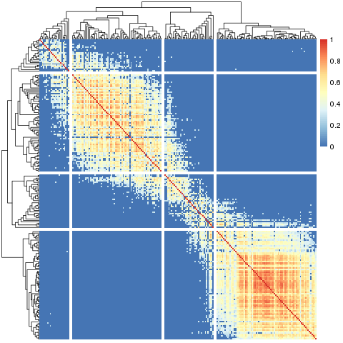

Slant.R
=======

Installation and Usage
----------------------

Download ``slant.r``. Inside R, ``source('slant.r')``.

Use ``sheatmap`` as a drop-in replacement to ``pheatmap``. In general, any argument to ``sheatmap``
(except ``clustering_callback``) is forwarded to ``pheatmap``, so all the diagram aspects can be
controlled in the usual way.

.. note::

   The ``clustering_callback`` is not supported, and the default ``clustering_method`` is
   ``ward.D2`` (the only other supported method is ``ward.D``). Otherwise, everything should behave
   identically to ``pheatmap``.

Lower-level functions are also available; see the `code documentation <slant.r>`_ for details.

The Problem
===========

Suppose we have some data that compares some elements. Often this compares all the pairs of
elements in a set, but sometimes pairs of elements from different sets. In the concrete example used
below, each element is a batch of ~1000 cells, which we have the combined RNA sequencing data for.
To load this data (and the ``slant`` functions), write:

.. code:: r

    read('data.Rda')
    source('slant.r')

We want to visualize and understand the similarities between these elements - in the example's case,
we know that the batches are sampled at different times during a fast development process, and are
interested in estimating how far along this process each batch is.

Naively, we can compute a matrix of similarities between the batches, by correlating their RNA
profiles. Technically, each element of this matrix tells us, for a specific pair of batches, how
similar they are to each other. This is exactly the data we loaded above (after setting all negative
correlations to zero).

The next step would be to visualize this data. R helpfully gives us the ``pheatmap`` function, which
will (by default) also cluster the data such that similar batches would be placed near each other.
That is, in theory, we would not only get a nice visualization, but we can hope to use this to
obtain some meaningful order of the batches, which might map to a position along the development
process we want to analyze.

So, we write:

.. code:: r

    pheatmap::pheatmap(data, show_rownames=F, show_colnames=F)

Which gives us:

.. image:: large_clustered_pheatmap.png

At a first glance, this seems to indicate there are two very sharply distinguished sub-groups, with
a third mixed group. We know the batches were sampled from a continuous process, and biological
processes are never like this. We definitely can't use this to estimate the position of each batch
along some development process.

Perhaps the problem is with the clustering? We could invoke ``pheatmap`` without any clustering at
all. This would preserve the data's order; if we had an a-priori order, this would be exactly what
we'd need to do to visualize the data. However, in our case, there is no such a-priori order - it is
exactly that which we are trying to extract from the data. Therefore, if we write:

.. code:: r

    pheatmap::pheatmap(data, show_rownames=F, show_colnames=F, cluster_rows=F, cluster_cols=F)

We will get:

.. image:: large_unclustered_pheatmap.png

Which most definitely is *not* what we want to see.

So, what went wrong? It turns out, our the data is fine. The problem is with the method we used to
visualize/analyze it.

Consider a clustering algorithm given the numbers 1, 2, 3, 4. We expect it to group the two low
values together, then the two high values, and combine them to a final ``( (1, 2), (3, 4) )`` tree.
In practice, however, such algorithms don't care about the internal order within each node. That is,
the algorithm would be just as happy giving us the tree ``( (4, 3), (1, 2) )`` which is technically
correct (but not the best kind of correct).

Amplify this problem to hundreds, or thousands, of elements, and it is obvious in retrospect that we
can't expect ``hclust`` (and therefore ``pheatmap``) to solve our problem. Enter "slanted matrices"
to the rescue.

Slanted Matrices
----------------

Technically, a "slanted matrix" is a matrix which is reordered such that its highest values are as
close to the diagonal as possible. This, in theory, should give us a clearer indication of the
overall structure of the data. We therefore write:

.. code:: r

    sheatmap(data, show_rownames=F, show_colnames=F, cluster_rows=F, cluster_cols=F)

Which gives us:

**This is exactly the same data as before.**

In this package, this is implemented by the ``slanted_orders`` function, which repeatedly sorts the
rows by the index of their "diagonal" column, and then the columns by the index of their "diagonal"
rows, until the system stabilizes (this is pretty fast).

The ``sheatmap`` function wraps all this (with additional functionality described below), similarly
to how ``pheatmap`` wraps the unordered ``hclust`` functionality.

.. note::

    * This works for any size similarity matrix, not necessarily the square symmetric matrix one
      gets from computing correlations.

    * The code actually works on the square of the data. This works OK-ish if the similarity data
      is a correlation and one takes -1 (perfect negative correlation) to be as strong a similarity
      indicator as +1 (perfect correlation). If the data isn't like that, just make sure it is all
      non-negative, where larger values are "more similar" - which we have done here by setting all
      negative correlations to zero.

Slanted Clustering
------------------

What if we still want to see the cluster structure of our data? The ``sheatmap``
function provides two options to do this, with different trade-offs.

Reordered Clustering
....................

If we have an a-priori clustering of the data, we can pass it to ``sheatmap`` (in the same way as
we pass it to ``pheatmap``, e.g. ``cluster_rows=hclust(...)``). In this case, ``sheatmap`` will
preserve the clustering, but at each node will pick the best order of the two sub-trees so that the
end result will be the "best" slanted order.

So, hoping that ``hclust`` gives the "optimal" results, and that the only problem is reordering
the batches, we write:

.. code:: r

    clusters <- hclust(data, method='ward.D2')
    sheatmap(data, show_rownames=F, show_colnames=F, cluster_rows=clusters, cluster_cols=clusters)

And get:

Better! But not a great result. We see a hint that there's a smooth transition between two states,
but the data is still too blocky to represent a continuous biological process. Still, this approach
might be the best if one wants to visualize a given clustering in the best possible way.

Ordered Clustering
..................

Since we don't have an a-priori clustering which we have strong evidence for, we can ask
``sheatmap`` to generate a clustering for us (in the same way as for ``pheatmap``, e.g.
``cluster_rows=T``).

In this (default) case, ``sheatmap`` will use ``oclust`` to generate a clustering tree which is
constrained to be compatible with the "ideal" slanted order. That is, writing:

.. code:: r

    sheatmap(data, show_rownames=F, show_colnames=F)

Will give us:

Much better! Here we only the see the clear gradient as before, but also that it splits naturally to
four phases (that smoothly transition from one to the next). We can highlight this by using
``cutree``:

.. code:: r

    sheatmap(data, show_rownames=F, show_colnames=F, cutree_rows=4, cutree_cols=4)

Which gives us:

The oclust function
...................

In general hierarchical clustering of elements (rows or columns in our case) tries to create a
binary tree such that the more similar two elements are, the closer they are in the tree. The twist
in ordered clustering (as implemented by ``oclust``) is that the elements are ordered, and each
group of elements clustered under any tree node must be a contiguous range of such elements.

Visually this means that if we draw the final clustering tree on top of the ordered elements, there
would be no edge crossings. This makes ordered clustering a natural addition to the slanted matrix
visualization.

That is, normally (as in ``pheatmap``), an unconstrained hierarchical clustering is done first, and
the matrix visualization order is chosen to be compatible with the clustering tree. Here (in
``sheatmap`` using ``oclust``), we do the opposite - we first order the elements for the slanted
matrix visualization, and then find a compatible clustering tree to go with it.

In principle it is possible to adapt any clustering method to include an ordering constraint. We
chose to adapt `Ward's method <https://en.wikipedia.org/wiki/Ward%27s_method>`_ (both ``ward.D`` and
the default ``ward.D2`` are supported). In this method, the algorithm starts with each element on
its own, and merges the two elements such that the total variance within the merged node is
minimized. It recursively merges groups of elements (minimizing the variance each time) until
obtaining the full clustering tree.

The general Ward's method can pick any two element groups to combine at each step. In contrast, the
ordered ``oclust`` variant can only choose adjacent element groups, trusting the slanting order to
have placed similar elements adjacent to each other. This makes the algorithm much faster, which
allows for a practical pure R implementation. The full Ward's method is slower, so requires a
FORTRAN implementation.

TODO
====

Convert this to a proper R package.

LICENSE (MIT)
=============

This code is available under the `MIT license <LICENSE.rst>`_.
