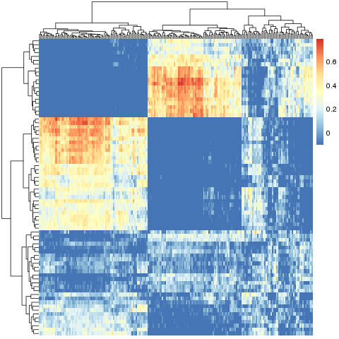
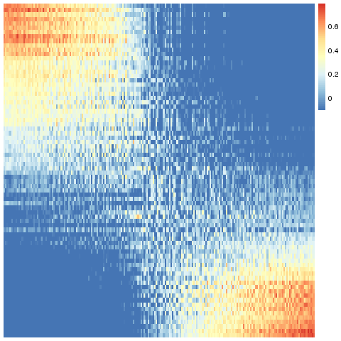
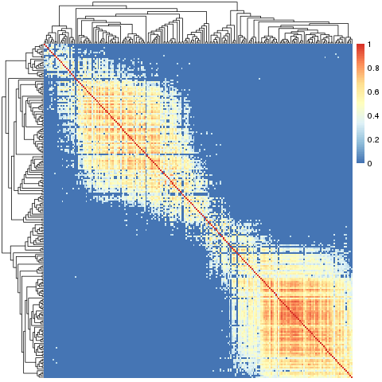

Slant.R
=======

Installation and Usage
----------------------

Download `slant.r`. Inside R, `source('slant.r')`.

Use ``sheatmap`` as a drop-in replacement to ``pheatmap``. Note that unlike ``pheatmap``, by default
``sheatmap`` does not cluster the rows and the columns, and that ``sheatmap`` provides some
additional flags to control slanting. Otherwise, you can pass any argument to ``sheatmap`` and it
will be forwarded to ``pheatmap``, so you can control all the diagram details in the usual way.

You can also use the lower-level ``slanted_order`` and ``slanted_reorder`` functions to just get the
visualization order for your data, and ``oclust`` to perform order-preserving clustering. See below
for more details.

TODO
....

Convert this to a proper R package.

The Problem
-----------

Given a matrix of some similarity data (that is, where data[i,j] is higher if the entity represented
by row i is "more similar" to the entity represented by column j), how best to visualize it?

Slanted Matrices
----------------

The default R solution is to use ``pheatmap``. This has the advantage it also reorders the data so
that most-similar rows (or columns) are near each other. This is very useful for visualizing the
clustering of the entries into some groups.

However, while the resulting clustering is "optimal" (for some clustering algorithm), the resulting
visualization is not necessarily the best one. Intuitively, humans prefer to see the data ordered
such that the highest-similarity values fall along a diagonal (traditionally, from the top-left to
the bottom-right of the diagram). That is, order both the rows and the columns, such that the most
similar rows of the first few columns are the first few rows, and so on until the most similar rows
of the last few columns are the last few rows.

It is best to demonstrate this with an example. Using the sample ``data.Rda`` contained here,
writing:

.. code:: r

    read('data.Rda')
    pheatmap::pheatmap(data, show_rownames=F, show_colnames=F)

Gives us:

While writing:

.. code:: r

    source('slant.r')
    sheatmap(data, show_rownames=F, show_colnames=F)

Gives us:

This is the same data!

The Method
..........

The ``sheatmap`` function invoked the ``slanted_orders`` function to compute the best
order of rows and columns, such that the highest data values will be the closest to
the matrix diagonal.

.. note::

    * This works for any size similarity matrix, not necessarily the square symmetric matrix one
      gets from computing correlations.

    * The code actually works on the square of the data. This works OK-ish if the similarity data
      is a correlation and one takes -1 (perfect negative correlation) to be as strong a similarity
      indicator as +1 (perfect correlation). If your data isn't like that, just make sure it is all
      non-negative, where larger values are "more similar".

Ordered Clustering
------------------

Unlike ``pheatmap``, by default ``sheatmap`` does not cluster the rows and columns. However, such
clustering is useful. Currently, this is achieved by doing order-preserving clustering of the data.

In general hierarchical clustering of entities (rows or columns in our case) tries to create a
binary tree such that the more similar two entities are, the closer they are in the tree. The twist
in ordered clustering is that the entities are ordered E = { e\ :sub:\ 1, ... e\ :sub:\ N } and each
group of entities clustered under any tree node must be a contiguous range of entities G = { e\
:sub:\ start, ..., e\ :sub:\ stop }.

Visually this means that if you draw the tree on top of the ordered entities, there would be no edge
crossings. This makes ordered clustering a natural addition to the slanted matrix visualization.
Normally, an unconstrained hierarchical clustering is done first, and the matrix visualization order
is chosen to be compatible with the clustering tree. Here we do the opposite - we first order the
entities for the slanted matrix visualization, and then find a compatible clustering tree to go with
it.

To find a good clustering tree, we first define the similarity between groups of entities (non-leaf
nodes). Say we have two groups A = { a\ :sub:\ 1, ... a\ :sub:\ n } and B = { b\ :sub:\ 1, ... b\
:sub:\ m }, we can define the similarity between A and B to be some function of all the similarity
measures between all the pairs (a\ :sub:\ i, b\ :sub:\ j). Three such aggregation functions are
provided: mean, min and max.

Given the ability to measure the similarity between groups of entities, we can use a heuristic to
find a good clustering tree. The ordering constraint severely restricts the possible clustering
trees, making these heuristics efficient with complexity of only O(n^2 log n). Two such heuristics
are provided:

The agglomerative heuristics works bottom-up. It starts with each entity as a separate group (leaf
tree nodes). At each step, it looks for the most similar pair of adjacent groups, and groups them
together (adds a parent node above these two nodes). This is repeated until we end up with a single
group (the root of the tree).

The divisive heuristic works top-down. It starts with the group of all entities (the root of the
tree). At each step, for some group containing more than one entity (non-leaf node), we look for the
best point to split it into two contiguous adjacent sub-groups (sub-nodes), such that these two
sub-groups are the least similar to each other. This is repeated until we only have groups of size 1
(leaf nodes).

By default, the algorithm uses the mean aggregation function combined with the agglomerative
heuristic, which seems to provide good results for a wide range of data sets.

For example, writing:

.. code:: r

    source('slant.r')
    sheatmap(data, show_rownames=F, show_colnames=F, cluster_cols=T, cluster_rows=T)

Gives us:

TODO
....

A better approach might be to compute the clustering tree first (which should give us an "optimal"
result), and then compute the best reordering of the entries which brings the high values closest to
the diagonal, while preserving the tree; that is, looking at each tree node, deciding on the best
order to present its two sub-trees. In theory this should give us both the most optimal clustering
and also great visualization.
