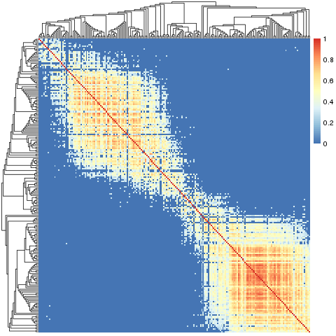

Slant.R
=======

Installation and Usage
----------------------

Download ``slant.r``. Inside R, ``source('slant.r')``.

Use ``sheatmap`` as a drop-in replacement to ``pheatmap``. In general, any argument to ``sheatmap``
(except ``clustering_callback``) is forwarded to ``pheatmap``, so all the diagram aspects can be
controlled in the usual way.

Lower-level functions are also available; see the `code documentation <slant.r>`_ for details.

The Problem
===========

Given a matrix of some similarity data (that is, where data[i,j] is higher if the entity represented
by row i is "more similar" to the entity represented by column j), how best to visualize it?

The default R solution is to use ``pheatmap``. This has the advantage it also reorders the data so
that most-similar rows (or columns) are near each other. This is very useful for visualizing the
clustering of the entries into some groups.

However, while the resulting clustering is "optimal" (for some clustering algorithm), the resulting
visualization is not necessarily the best one. Intuitively, all ``pheatmap`` cares about (if
anything) is the clustering tree, but not its order. In one dimensions, consider clustering the
numbers 1 through 4. The ``pheatmap`` is as happy with the tree ``(4,3), (1,2)`` as it is with the
more legible tree ``(1,2), (3,4)``. In two dimensions, this results in illegible, and at times
downright misleading, heatmaps.

It is best to demonstrate this with an example. All the example code below assumes we first:

.. code:: r

    read('data.Rda')
    source('slant.r')

Then, writing:

.. code:: r

    pheatmap::pheatmap(data, show_rownames=F, show_colnames=F)

Gives us:

.. image:: large_clustered_pheatmap.png

At a first glance, this seems to indicate there are two very sharply defined sub-groups, with some
noise. A closer look shows a different picture.

Slanted Matrices
----------------

A "slanted matrix" is a matrix which is reordered such that its highest values are as close to the
diagonal as possible. In this package, this is implemented by the ``slanted_orders`` function, which
repeatedly sorts the rows by the index of their "diagonal" column, and then the columns by the index
of their "diagonal" rows, until the system stabilizes (this is pretty fast).

.. note::

    * This works for any size similarity matrix, not necessarily the square symmetric matrix one
      gets from computing correlations.

    * The code actually works on the square of the data. This works OK-ish if the similarity data
      is a correlation and one takes -1 (perfect negative correlation) to be as strong a similarity
      indicator as +1 (perfect correlation). If your data isn't like that, just make sure it is all
      non-negative, where larger values are "more similar".

The ``sheatmap`` function wraps this (with additional functionality described below). We'll begin
with ignoring the clustering, writing:

.. code:: r

    sheatmap(data, show_rownames=F, show_colnames=F, cluster_rows=F, cluster_cols=F)

Gives us:

.. image:: large_unclustered_sheatmap.png

**This is exactly the same data as before.**

Note that if we do not perform any clustering, ``pheatmap`` will preserve the original data order.
Sometimes this is exactly what you want, but when the data has no a-priori order, writing:

.. code:: r

    pheatmap::pheatmap(data, show_rownames=F, show_colnames=F, cluster_rows=F, cluster_cols=F)

Gives us:

.. image:: large_unclustered_pheatmap.png

Which most definitely is *not* what we want to see.

Slanted Clustering
------------------

What if we still want to see the cluster structure of our data? The ``sheatmap``
function provides three options to do this, with different trade-offs.

Reordering
..........

By default (or if you specify ``clusters='reorder'``), if clustering is done,
then ``sheatmap`` will preserve it. However, it will use the fact that clustering
does not specify (total) order, to reorder the clustering tree to best fit the
slanted order. For example, writing:

.. code:: r

    sheatmap(data, show_rownames=F, show_colnames=F)

Gives us:

.. image:: large_reordered_sheatmap.png

Modifying
.........

A stronger option is to allow ``sheatmap`` to modify the clustering tree. By specifying
``clusters='modify'``, it maintains the "ideal" slanted order, and generate a compatible clustering
tree which is the "closest possible" to the original unconstrained clustering. For example, writing:

.. code:: r

    sheatmap(data, show_rownames=F, show_colnames=F, clusters='modify')

Will give us:

We can see that while in theory the approach seems promising, in practice it tends to generate
low-quality clustering trees. However, YMMV.

Replacing
.........

Finally, ``sheatmap`` allows to simply build a brand-new clustering tree, tailored to the
"ideal" slanted order. By specifying ``clusters='replace'``, the code will discard the
original clustering (if any), and will invoke ``oclust`` (see below) to get a new one.
For example, writing:

.. code:: r

    sheatmap(data, show_rownames=F, show_colnames=F, clusters='replace')

Will give us:

.. image:: large_replaced_sheatmap.png

Here we see not only the clear gradient, but also that it splits naturally to four parts
(that smoothly transition from one to the next). We can highlight this by using ``cutree``:

.. code:: r

    sheatmap(data, show_rownames=F, show_colnames=F, clusters='replace', cutree_rows=4, cutree_cols=4)

Which gives us:

.. image:: large_cut_replaced_sheatmap.png

Which is pretty good, even though it doesn't have the claim of "optimality" that the original
unrestricted clustering offers.

Ordered Clustering
------------------

In general hierarchical clustering of entities (rows or columns in our case) tries to create a
binary tree such that the more similar two entities are, the closer they are in the tree. The twist
in ordered clustering (as implemented by ``oclust``) is that the entities are ordered E = { e_1, ...
e_N } and each group of entities clustered under any tree node must be a contiguous range of
entities G = { e_start, ..., e_stop }.

Visually this means that if you draw the tree on top of the ordered entities, there would be no edge
crossings. This makes ordered clustering a natural addition to the slanted matrix visualization.
Normally, an unconstrained hierarchical clustering is done first, and the matrix visualization order
is chosen to be compatible with the clustering tree. Here we do the opposite - we first order the
entities for the slanted matrix visualization, and then find a compatible clustering tree to go with
it.

To find a good clustering tree, we first define the similarity between groups of entities (non-leaf
nodes). Say we have two groups A = { a_1, ... a_n } and B = { b_1, ... b_m }, we can define the
similarity between A and B to be some function of all the similarity measures between all the pairs
(a_i, b_j). We are using the average of all the measures as this seems to give the best results.

Given the ability to measure the similarity between groups of entities, we use a heuristic to find a
good clustering tree. The ordering constraint severely restricts the possible clustering trees,
making this efficient with complexity of only O(n^2 log n).

Specifically, this heuristic works bottom-up. It starts with each entity as a separate group (leaf
tree nodes). At each step, it looks for the most similar pair of adjacent groups, and groups them
together (adds a parent node above these two nodes). This is repeated until we end up with a single
group (the root of the tree).

TODO
====

Convert this to a proper R package.

LICENSE (MIT)
=============

This code is available under the `MIT license <LICENSE.rst>`_.
